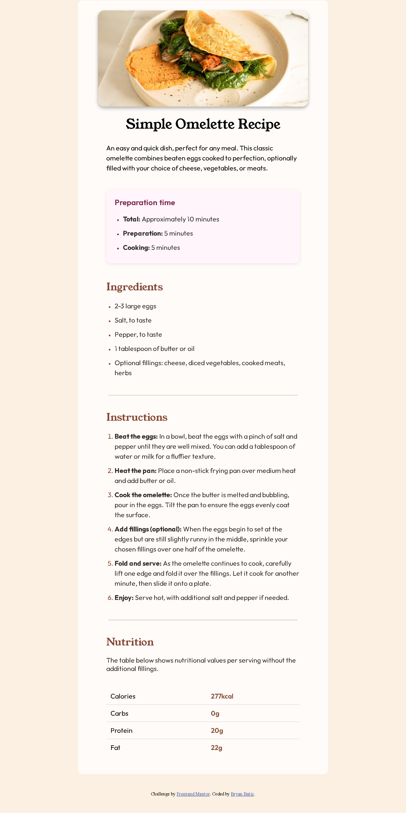

# Frontend Mentor - Recipe page solution

This is my solution to the [Recipe page challenge on Frontend Mentor](https://www.frontendmentor.io/challenges/recipe-page-KiTsR8QQKm). The challenge helped me practice semantic HTML, responsive CSS, and accessibility techniques.

## Table of contents

- [Overview](#overview)
  - [The challenge](#the-challenge)
  - [Screenshot](#screenshot)
  - [Links](#links)
- [My process](#my-process)
  - [Built with](#built-with)
  - [What I learned](#what-i-learned)
  - [Continued development](#continued-development)
  - [Useful resources](#useful-resources)
- [Author](#author)
- [Acknowledgments](#acknowledgments)

## Overview

### The challenge

Users should be able to:

- View the recipe page on desktop and mobile screens
- See smooth transitions when resizing the page
- Experience accessible and readable content

### Screenshot



### Links

- Solution URL: [https://github.com/Rinzet/recipe-page-main](https://github.com/Rinzet/recipe-page-main)
- Live Site URL: [https://rinzet.github.io/recipe-page-main/](https://rinzet.github.io/recipe-page-main/)

## My process

### Built with

- Semantic HTML5 markup
- CSS custom properties
- Flexbox
- Mobile-first workflow
- Media queries for responsiveness
- CSS transitions for smooth animations

### What I learned

- How to use semantic HTML for better accessibility and SEO.
- How to create a responsive layout using Flexbox and media queries.
- How to use CSS transitions to animate changes in padding, border-radius, and box-shadow for a smoother user experience.
- How to structure image paths and assets for deployment on GitHub Pages.

```css
.main-wrapper {
  transition: padding 0.6s cubic-bezier(0.4,0,0.2,1);
}
```

### Continued development

- Improve accessibility by adding ARIA labels and roles.
- Explore CSS Grid for more complex layouts.
- Add dark mode support.

### Useful resources

- [MDN Web Docs - Flexbox](https://developer.mozilla.org/en-US/docs/Web/CSS/CSS_Flexible_Box_Layout/Basic_Concepts_of_Flexbox)
- [MDN Web Docs - Media Queries](https://developer.mozilla.org/en-US/docs/Web/CSS/Media_Queries)
- [WCAG Quick Reference](https://www.w3.org/WAI/WCAG21/quickref/)

## Author

- Frontend Mentor - [@Rinzet](https://www.frontendmentor.io/profile/Rinzet)

## Acknowledgments

Thanks to Frontend Mentor for the challenge and the community for feedback
